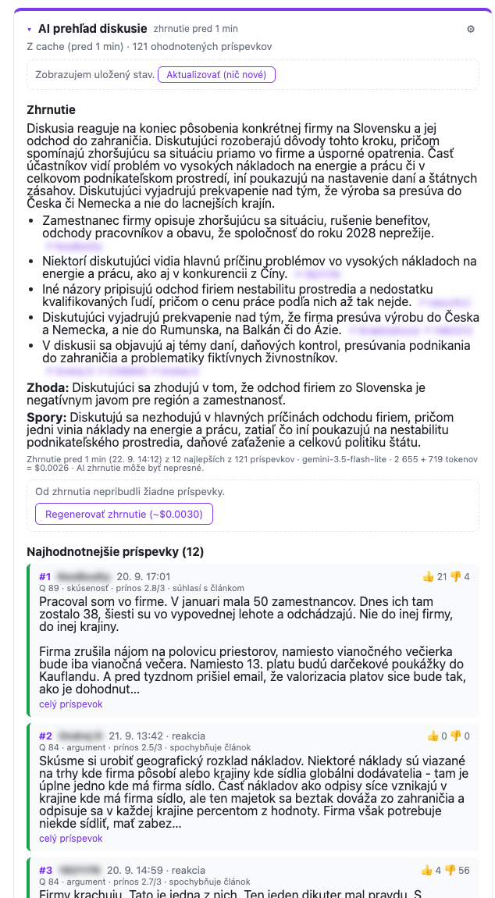
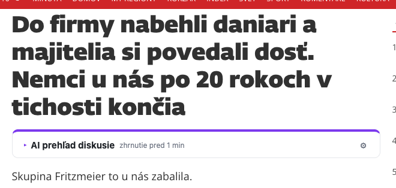
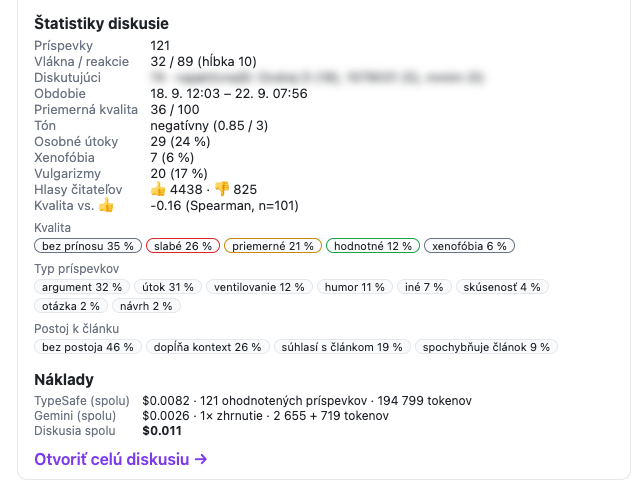
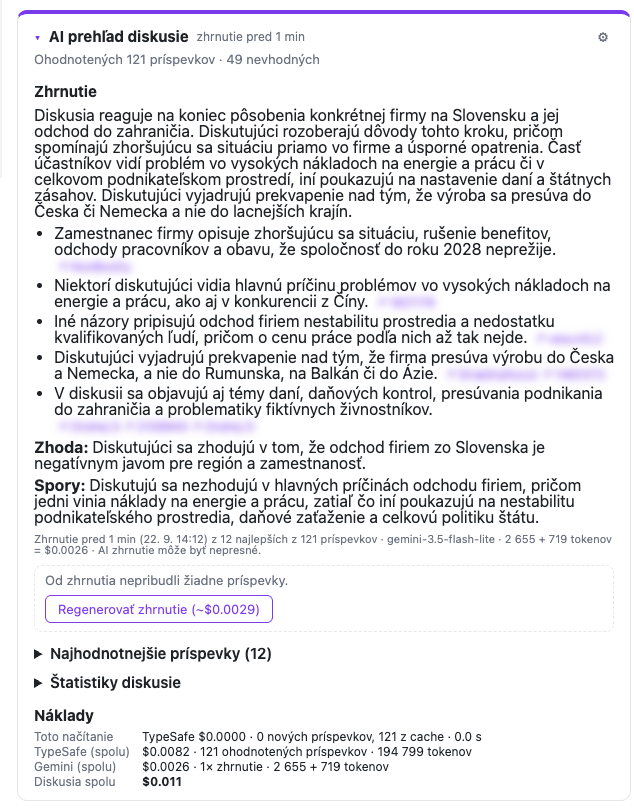
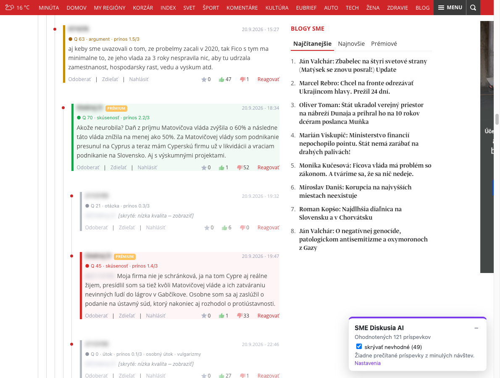
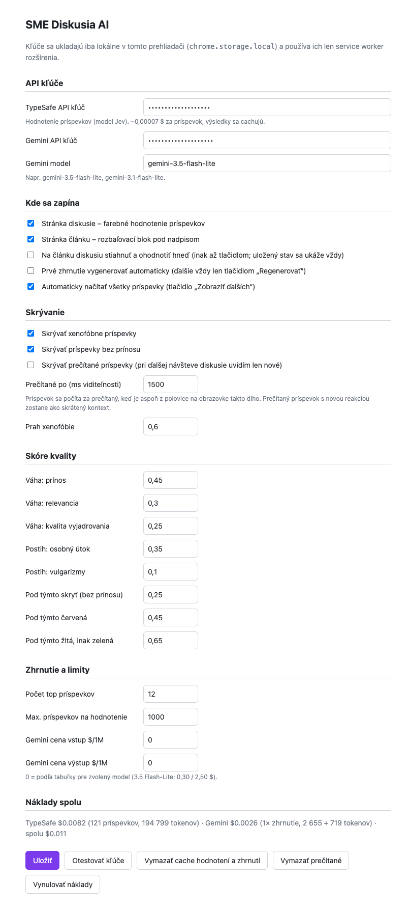

# SME Diskusia AI

Chrome rozšírenie, ktoré v diskusiách na [sme.sk](https://www.sme.sk) **hodnotí každý príspevok** (prínos, relevancia, kvalita vyjadrovania, tón, osobné útoky, xenofóbia…), **farebne ho označí alebo skryje** a pod článkom zobrazí **AI zhrnutie najhodnotnejších príspevkov**, štatistiky diskusie a presné náklady.

> Neoficiálny osobný projekt. Nie je spojený so SME ani s vydavateľstvom Petit Press.

- Hodnotenie príspevkov: [TypeSafe](https://typesafe.ai) (model Jev) – typované, kalibrované odpovede namiesto generovaného textu
- Zhrnutie: Google Gemini Flash-Lite (štruktúrovaný JSON výstup)
- Chrome MV3, bez závislostí a bez build kroku



## Čo robí

### Na stránke článku
Pod nadpisom pribudne rozbaľovací blok **AI prehľad diskusie**. Bez kliknutia sa neplatí nič: zobrazí sa iba počet príspevkov, prípadne uložený stav z cache.

| Zbalený blok | Štatistiky a náklady |
|---|---|
|  |  |

- **Načítať a ohodnotiť diskusiu (~$)** stiahne všetky príspevky z API fóra a ohodnotí len tie, ktoré ešte nie sú v cache.
- **Vygenerovať / Regenerovať zhrnutie (~$)** sa nikdy nespustí samo. Pred regeneráciou blok ukáže, koľko príspevkov pribudlo od posledného zhrnutia, koľko z nich je užitočných a koľko nových by vstúpilo do výberu.
- Kľúčové body zhrnutia odkazujú na konkrétne príspevky.
- **Štatistiky:** počet príspevkov a vlákien, najaktívnejší diskutujúci, priemerná kvalita, tón, podiel osobných útokov, xenofóbie a vulgarizmov, typy príspevkov, postoj k článku a súvis kvality s hlasmi 👍.
- **Náklady:** cena tohto načítania, súčet za diskusiu (TypeSafe + Gemini) a cena každého zhrnutia.

### Na stránke diskusie
| Blok nad diskusiou | Označené príspevky |
|---|---|
|  |  |

- Každý príspevok má **farebný okraj a štítok**: zelená (hodnotné), žltá, červená, šedá (skryté). Štítok ukazuje skóre, typ príspevku, prínos a prípadne osobný útok, xenofóbiu či vulgarizmy.
- Xenofóbne príspevky a príspevky bez prínosu sa **zbalia** s odkazom „zobraziť“.
- **Skrývanie prečítaných:** príspevok, ktorý bol aspoň 1,5 s z polovice na obrazovke, sa pri ďalšej návšteve skryje. Uvidíš len nové, s tlačidlom „Skrytých N prečítaných – Zobraziť“. Prečítaný príspevok s novou reakciou zostane ako skrátený kontext.
- Automaticky sa načítajú všetky príspevky, aj nad limitom 50.

### Nastavenia


API kľúče, model Gemini, kedy sa čo spúšťa, skrývanie, váhy a prahy skóre, top N a ceny. Zmena váh a prahov sa prejaví bez nového volania modelu.

## Inštalácia
1. Stiahni alebo naklonuj repozitár.
2. Otvor `chrome://extensions`, zapni **Developer mode** a klikni na **Load unpacked**. Vyber priečinok [`extension/`](extension/).
3. Klikni na ikonu rozšírenia a vlož kľúče:
   - **TypeSafe API key:** [typesafe.ai](https://typesafe.ai)
   - **Gemini API key:** [Google AI Studio](https://aistudio.google.com/apikey)
4. Klikni **Otestovať kľúče** a otvor ľubovoľný článok na sme.sk.

Kľúče sú uložené len lokálne v `chrome.storage.local` a používa ich iba service worker rozšírenia. Do stránky sme.sk sa nedostanú.

## Náklady (namerané)
| | cena | poznámka |
|---|---|---|
| TypeSafe, 1 príspevok | ~0,00007 $ | ~1 750 vstupných tokenov × 0,042 $/1M; každý príspevok sa hodnotí raz |
| TypeSafe, diskusia so 121 príspevkami | ~0,008 $ | ohodnotenie trvá ~4 s (6 paralelných requestov) |
| Gemini 3.5 Flash-Lite, 1 zhrnutie | ~0,0026 $ | ~2 700 vstupných + ~700 výstupných tokenov |

Všetko sa cachuje: hodnotenia podľa ID a hashu textu, zhrnutie, snímka diskusie a prečítané príspevky. Pri opakovanej návšteve sa platí len za nové príspevky, pri návrate na článok nič.

## Ako to funguje
```
content script (sme.sk)                  service worker                      externé API
 ├ [data-topic-id] → ID diskusie          ├ kľúče, nastavenia, cache
 ├ API fóra core-forum.sme.sk ───────────►├ TypeSafe: 9 otázok na príspevok ──► api.typesafe.ai
 │  (stránkovanie kurzorom, po 100)       │  (score / noul / choice, fan-out)
 │                                        ├ politika v kóde → kvalita, farba
 │                                        ├ štatistiky, výber top N
 │◄──────────── stav, priebeh (port) ─────┤ Gemini: zhrnutie top N (JSON) ────► generativelanguage.googleapis.com
 ├ článok: blok pod nadpisom (Shadow DOM)
 └ diskusia: dekorácia príspevkov, skrývanie, sledovanie prečítaných
```
Na každý príspevok sa položí 9 otázok naraz. Model dostane článok, príspevok, na ktorý sa reaguje, a samotný príspevok:

| otázka | typ | význam |
|---|---|---|
| `substance` | score 0–3 | prínos: nič → nová informácia, analýza, riešenie |
| `relevance` | score 0–3 | mimo témy → jadro problému |
| `writing` | score 0–3 | kvalita vyjadrovania |
| `sentiment` | score 0–3 | tón |
| `personal_attack` | noul | urážka alebo zosmiešnenie konkrétnej osoby |
| `group_hate` | noul | hanlivé zovšeobecnenie podľa národnosti, etnika alebo regiónu |
| `vulgar` | noul | vulgarizmy |
| `kind` | choice | skúsenosť / argument / návrh / otázka / humor / útok / ventilovanie / iné |
| `stance` | choice | postoj k článku |

Kvalita = vážený súčet prínosu, relevancie a vyjadrovania, mínus postih za osobný útok a vulgarizmy. Pri xenofóbii nad prahom sa príspevok skryje. Farby a prahy sú čistá politika v kóde ([`lib/policy.js`](extension/lib/policy.js)).

Podrobnosti o návrhu a zisteniach o API sme.sk sú v [extension/PLAN.md](extension/PLAN.md), dokumentácia rozšírenia v [extension/README.md](extension/README.md).

## Kvalita klasifikácie (PoC)
Overené na 47 príspevkoch voči ručným anotáciám (jeden anotátor, orientačné čísla). Detaily sú v [poc/README.md](poc/README.md).

| signál | výsledok |
|---|---|
| xenofóbia / hate | AUC 1,00, presnosť 1,00, záchyt 0,88 |
| prínos k téme | Spearman 0,77 (kompozitné skóre 0,78) |
| osobný útok | AUC 0,86, presnosť a záchyt ~0,65, preto sa iba penalizuje a samostatne neskrýva |
| sarkazmus | nespoľahlivý (presnosť 0,35), preto sa nepoužíva |
| stabilita medzi behmi | priemerný drift ~0,03 na škále 0–3 |

Zaujímavosť: hodnotenie takmer nesúvisí s 👍 čitateľov (Spearman ~0 až −0,16). Hlasy merajú súhlas, nie kvalitu. Na diskusii zo screenshotov model označil ~40 % príspevkov ako bez prínosu alebo nevhodné. Prahy sa dajú v nastaveniach zmierniť.

## Vývoj a testy
```bash
cd extension
node --test tests/*.test.js                          # 24 testov: knižnice + service worker vo vm s falošným chrome.* a API
node tests/build-test-bundle.mjs /tmp/bundle.js      # bundle na injektovanie do stránky (Playwright addScriptTag)
```
Integračný test service workera overuje, že sa nič neplatí dvakrát:
- rovnaký príspevok sa neohodnotí dvakrát ani pri dvoch súbežných taboch,
- zhrnutie vzniká len na požiadanie,
- pohľad z cache nevolá API.

Test bundle spúšťa v stránke skutočný `background.js`; falošné sú len `chrome.*` a AI API. Takto vznikli aj screenshoty, s rozmazanými menami diskutujúcich.

## Obmedzenia
- Selektory `.anz-post[data-post-id]`, `[data-topic-id]` a API `core-forum.sme.sk` nie sú verejne zdokumentované a môžu sa zmeniť.
- Kľúče sú v `chrome.storage.local` nešifrované, čo je v poriadku pre osobné použitie. Pri distribúcii iným ľuďom treba vlastný backend.
- AI zhrnutie môže byť nepresné. Vychádza len z vybraných príspevkov a nie je zhrnutím článku.
